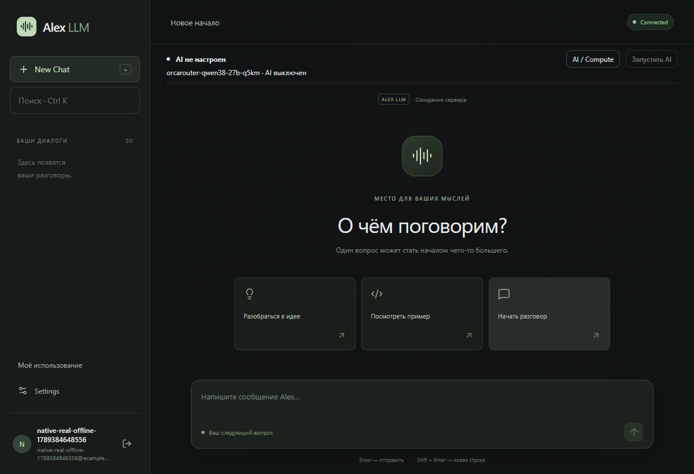

# Real OrcaRouter connection — 0.3.0 preflight

This stage adds a real protocol implementation. A successful paid GPU/model E2E has **not** been claimed: it requires the user's separate confirmation.
No Presence, heartbeat, Memory, RAG, files, web, browser, terminal-agent, coding-agent or training work is included.

## Data flow and connection protection

Desktop → authenticated FastAPI → LlamaCppProvider → current Pod's RunPod HTTPS proxy → authenticated gateway → localhost:8080 llama.cpp.

The backend derives `https://{verified-current-pod-id}-9000.proxy.runpod.net` from the managed session after RunPod reconciliation.
No old IP is hardcoded, no private connection URL/key is returned to the desktop, and redirects are disabled.
The public Pod port list contains only `9000/http`. Raw llama.cpp 8080 and SSH are not published.

`remote_runtime.py` is sent as executable source in the Pod startup arguments; it contains no credential.
The gateway credential is supplied separately in the Pod environment and remains backend-only. The gateway fails closed without a sufficiently long key.
It compares bearer credentials using constant-time comparison and allows only GET `/v1/models` and POST `/v1/chat/completions`.
It rejects other routes, chunked request bodies and bodies above 1 MiB. Request/response bodies and Authorization are not logged.
TLS terminates at RunPod's HTTPS proxy; the RunPod proxy-to-container hop is provider-managed HTTP. This is not a claim of end-to-end private networking.

The gateway forwards upstream chunks immediately, flushes each write, and closes the model-side socket when its client disconnects.
The provider closes its HTTP stream/client on cancellation and generator close. Abort propagates from desktop fetch through FastAPI to the gateway;
the actual RunPod proxy cancellation behavior remains a required part of the paid E2E.

## Startup and readiness

The runtime checks the existing GGUF and scripts, takes a Linux file lock to prevent duplicate startup, and inspects localhost `/v1/models`.
If the process is absent it invokes `/workspace/start-llm.sh`. If it is loading (503) or already running, it does not launch another copy.
It waits for the configured model alias, runs `/workspace/check-llm.sh`, then emits heartbeat phase markers.
The backend independently verifies `/v1/models` through the authenticated external channel before marking AI Ready.
503 is `loading_model`, not a fatal startup error. Auth failure, unavailable connection, wrong model and malformed responses remain non-ready.
The existing startup deadline and budget protect the managed compute. A model failure after readiness emits an error and triggers managed termination.

The actual scripts on Network Volume have not yet been inspected/executed in this stage because all existing Pods are stopped.
Their compatibility, listen address and model alias will be verified during the approved live run. No model download or Volume deletion is implemented.

## Configuration

In `apps/backend/.env`:

```dotenv
LLM_PROVIDER=llamacpp
LLM_CONNECTION_MODE=runpod
LLM_MODEL=orcarouter-qwen38-27b-q5km
LLM_API_KEY=<random backend-only gateway credential, at least 32 characters>
RUNPOD_API_KEY=<RunPod account API key, backend only>
RUNPOD_GATEWAY_PORT=9000
RUNPOD_LLM_PORT=8080
ADMIN_EMAILS=["your-registered-email@example.com"]
```

Do not paste keys into chat, desktop settings, logs or Git. Local gateway-key generation is independent of RunPod credentials.
`LLM_CONNECTION_MODE=static` instead uses `LLM_BASE_URL`; remote connections require HTTPS and an API key, while a preconfigured SSH tunnel may use localhost HTTP.
The RunPod mode intentionally refuses to silently connect to an unrelated pre-existing external Pod without an established protected gateway.
`LLM_PROVIDER=mock` remains supported; frontend has no provider selection switch.

## Controls, usage and recovery

Main panel: Start AI while offline, Cancel Search while searching, Stop AI whenever a tracked session exists, and Stop After Answer while generating.
An idle managed session stops immediately on the main button. Active generation opens a confirmation and then schedules stop-after-answer.
The dialog also includes Stop. Compute shared across users remains singular; chats/JWT/history remain isolated.
Admins additionally see current Pod and users with active llama.cpp generations (not online presence).

Provider requests `stream_options.include_usage=true`. If reported, prompt/completion/total tokens are persisted separately as input/output/total tokens.
Unreported usage stays null, including cancelled responses without usage. Migration 0003 adds total tokens without changing existing rows.
Summaries expose token totals alongside request counts and estimated compute costs; these are not supplier invoices.

After restart, compute state/id/price/start time is loaded, RunPod state reconciled and the HTTPS target derived again. The model is probed again;
a stale prior Ready does not authorize a new generation. Unknown create is still held for reconciliation rather than retried.
Stop keeps the Network Volume, model, scripts and chat history, records stopped_at and fixes estimated session cost.

## Local validation and live boundary

- 59 backend tests: prior regressions, model alias/503/auth/timeout/malformed SSE/disconnect, immediate stream close, real-provider usage persistence,
  authenticated gateway route protection and socket disconnect, dynamic target/loading/ready/recovery/stop via mocked RunPod.
- 8 frontend unit tests and 5 Playwright scenarios, including visible Start/Cancel/Stop, model loading and stop-after-answer.
- Ruff, TypeScript/Vite, Prettier and npm audit (0 vulnerabilities).
- cargo check, Tauri release and NSIS installer: passed for 0.3.0.
- Native WebView2 smoke: passed in mock mode for chat regression; then the backend was switched to llamacpp and a second native test confirmed Offline, model label, visible Start and disabled Send without GPU. This is not a live-model response test.
- SQLite 0003 applied after a backup; `alembic check` found no new upgrade operations.

Local output files are `../Alex LLM.exe` and `../Alex LLM Setup.exe` relative to the repository root; the existing desktop shortcut targets the updated executable.
The local backend is now configured for `llamacpp` and the requested account is configured as admin. A gateway credential was generated locally without display.
The RunPod account API key is still missing; it must be entered only in backend `.env` before the paid test can run through the application.



Read-only RunPod preflight on 2026-09-14 initially returned NVIDIA L40S 48 GB, US-TX-3, $1.09/hour, stock LOW. The final refresh returned no available compatible NVIDIA GPU with at least 48 GB within $1.20/hour in US-TX-3 (Secure Cloud, CUDA >= 12.8). The earlier LOW stock is no longer current.
All three existing Pods returned EXITED. No paid mutation has been made. Availability/price must be rechecked immediately before the approved run.

Planned controlled E2E: one new Pod → existing Volume → model Ready → Russian streaming question → Stop generation → usage → Stop AI → verify terminated/EXITED.
Before create, obtain explicit approval naming GPU/VRAM/DC/price/volume, duration/budget and mandatory cleanup. Never leave the test GPU running without permission.

## Next stage (not started)

Presence / Online Users → Long-Term Memory → RAG + Files → Web Search → Browser / Tools → Coding Agent → Fine-tuning / LoRA.

Sources: [llama.cpp server](https://github.com/ggml-org/llama.cpp/tree/master/tools/server),
[RunPod HTTP proxy](https://docs.runpod.io/pods/configuration/expose-ports), [RunPod REST v2](https://api.runpod.io/v2/openapi.json).
