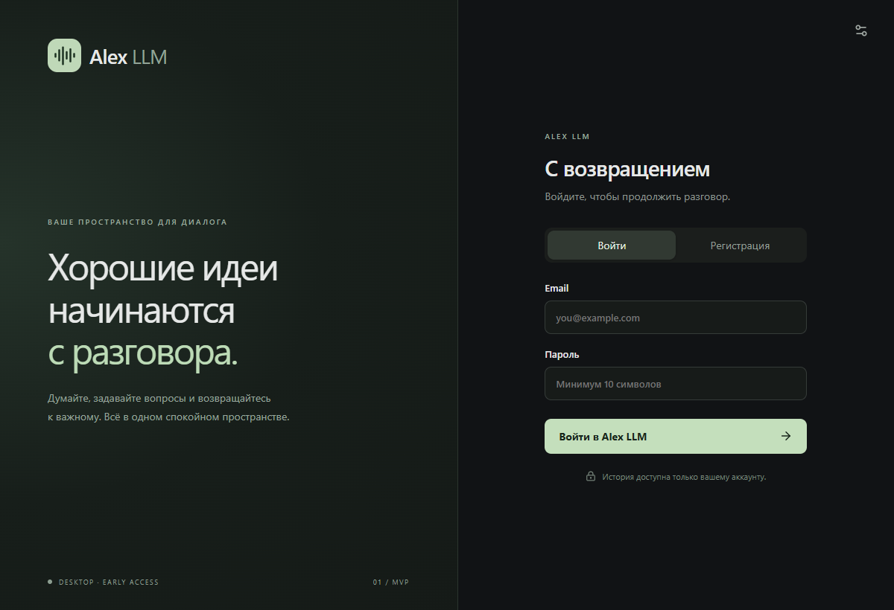
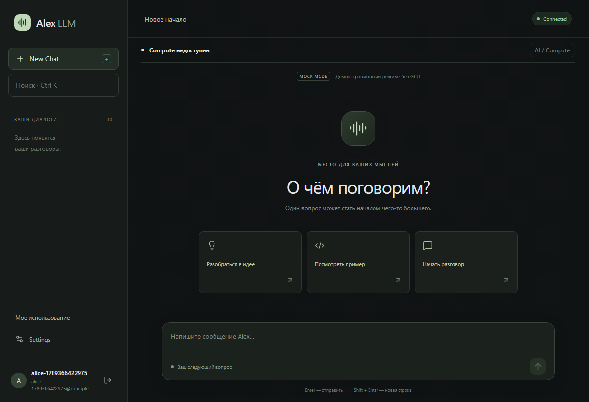
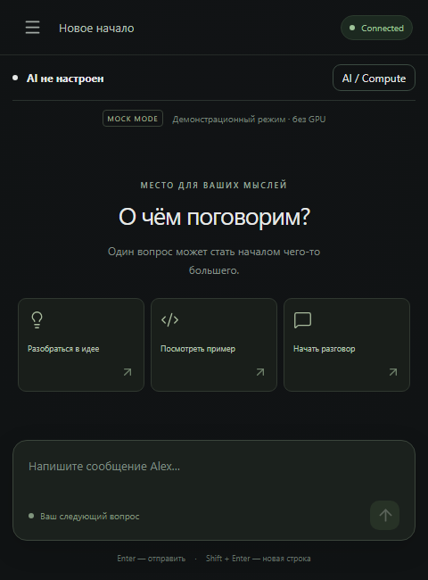

# Alex LLM — отчёт о реализации MVP

Проверено 13 сентября 2026 на Windows x64.

## Расположение и результат

Проект: `C:\Users\Volkr\Documents\Codex\2026-09-13\x20\outputs\alex-llm`.
Подготовлены нативное приложение `Alex LLM.exe` и установщик `Alex LLM Setup.exe` в соседнем каталоге `outputs`.
Исходные результаты сборки находятся в `apps/desktop/src-tauri/target/release`.

Monorepo включает `apps/backend`, `apps/desktop`, `docs`, `scripts`, шаблоны env и шаблон GitHub Actions workflow.
Подробная структура и команды описаны в [README](../README.md).

## Что реализовано

- Регистрация, вход и `/auth/me`; Argon2id; JWT с issuer, audience и сроком действия 60 минут.
- Таблицы users/chats/messages, Alembic, SQLite WAL, каскадное удаление и проверка владельца всех операций.
- Все запрошенные API endpoints, плюс `/chats/{id}/generation` для синхронизации после Stop.
- Dark theme, адаптивное окно, история, новый диалог, удаление, Markdown/GFM, code blocks и Copy.
- POST SSE с постепенным выводом, отменой и сохранением частичного ответа.
- Settings: backend URL и размер текста; Connected/Offline; обработка ошибок и истёкшей сессии.
- `LLMProvider`, активный `MockLLMProvider`, подготовленный и неактивный `LlamaCppProvider`.
- Клиентские компоненты, hook управления чатом и транспорт разделены. Токен хранится только в памяти.
- Backend env отделён от публичной конфигурации клиента. В Git не включаются секреты, база, venv и build-каталоги.

## Среда

| Компонент | Проверенная версия / состояние |
|---|---|
| Node.js / npm | 24.13.0 / 11.6.2 |
| Python для backend | 3.12.9; Python 3.14 также доступен в системе |
| Rust / Cargo | 1.98.1, target `x86_64-pc-windows-msvc` |
| Visual Studio Build Tools | 2022, C++ tools и Windows SDK установлены |
| WebView2 Runtime | 152.0.4191.66 |
| Tauri | Rust crate 2.11.5, CLI 2.11.4 |
| React / Vite / TypeScript | 19.3.0 / 7.3.6 / 5.9.3 |
| FastAPI / SQLAlchemy / Alembic | 0.141.1 / 2.0.52 / 1.20.0 |

Для выполнения задания установлены Rust toolchain и Visual Studio C++ Build Tools — необходимые зависимости Windows-сборки.
Зависимости backend находятся в проектном `.venv`, frontend — в `node_modules`.

## Пройденные проверки

| Проверка | Результат |
|---|---|
| Backend pytest | **15 passed** |
| Ruff | **passed** |
| Alembic schema check | **no new upgrade operations** |
| SQLite upgrade → check → downgrade → upgrade на временной БД | **passed** |
| PostgreSQL offline SQL compilation | **passed**, без подключения к PostgreSQL |
| Frontend TypeScript + Vite production build | **passed** |
| SSE / URL unit tests | **7 passed** |
| Playwright E2E с настоящим backend и временной БД | **2 passed** |
| Prettier format check | **passed** |
| npm audit | **0 vulnerabilities** |
| Tauri release build | **passed** |
| Windows NSIS installer build | **passed** |
| Нативный WebView2 smoke test | **passed** |

Backend-тесты проверяют хеширование, неверный пароль, дубли email, expiration, обязательную авторизацию,
изоляцию чтения/удаления/сообщений/streaming, CORS, валидацию, запрет подстановки роли, сохранение ответа,
каскадное удаление, блокировку параллельной генерации и сбой провайдера.
llama.cpp adapter проверен через HTTP mock transport, без реального inference и без сетевых запросов к RunPod.

E2E проверяет регистрацию двух пользователей, Markdown, реальную постепенную передачу, Copy, Stop,
повторное открытие сохранённого ответа, изоляцию истории, удаление, вход после выхода и отсутствие токена после reload.
Второй сценарий проверяет окно 480×650, Settings, отсутствие горизонтального переполнения и восстановление Offline → Connected.

Нативный smoke test выполнен именно на собранном Windows `.exe` через WebView2: HTTPS origin `https://tauri.localhost`,
регистрация, backend CORS, streaming, буфер обмена, Stop, история, удаление, выход. Окно отвечает на действия.
Временный debugging endpoint использовался только для теста; затем приложение перезапущено без него.

В тестах backend остаются два upstream deprecation warnings Starlette/AnyIO о test transport и старом alias.
Они не являются проваленными проверками. Установщик собран, но интерактивная установка/удаление не выполнялась.
Живой PostgreSQL и реальный LLM не проверялись. Шаблон GitHub Actions находится в `docs/ci-windows.yml` и не активирован:
у текущего GitHub credential отсутствует право `workflow`, необходимое для загрузки `.github/workflows/ci.yml`.
Репозиторий приватный: https://github.com/volkrist/alex-llm. Локальные проверки выполнены независимо от GitHub Actions.

## Запуск

Из корня проекта, два окна PowerShell:

```powershell
# Backend
.\scripts\start-backend.ps1
```

```powershell
# Desktop development
.\scripts\start-desktop.ps1
```

Для обычного запуска достаточно работающего backend и `Alex LLM.exe`.
Первоначальная настройка на новой машине: `scripts/setup-backend.ps1`, затем `npm ci` в `apps/desktop`.
Нативная пересборка: `scripts/build-desktop.ps1`.

Тестовый пользователь: открыть **Регистрация**, указать `tester@example.com` и собственный пароль от 10 символов.
Предустановленных паролей нет. Mock работает сразу, без GPU и API keys.

## Env и следующий этап

Обязательный секрет — только backend `JWT_SECRET`; setup генерирует его автоматически.
Для локальной работы заданы `DATABASE_URL=sqlite:///./alex.db`, `LLM_PROVIDER=mock` и явные CORS origins.
Полный список переменных приведён в [README](../README.md#configuration).
В desktop разрешён только публичный `VITE_BACKEND_URL`; текущий адрес также меняется в Settings.

MVP работает с одним процессом backend и несколькими аккаунтами. Для публичного production следующими шагами будут
HTTPS-развёртывание, живой PostgreSQL, rate limits, shared generation locks, восстановление аккаунта, backups и code signing.
Реальный LLM подключается отдельным этапом после явного решения пользователя.

**RunPod не использовался. Pods не создавались, не запускались, не останавливались и не удалялись.**

## Скриншоты





