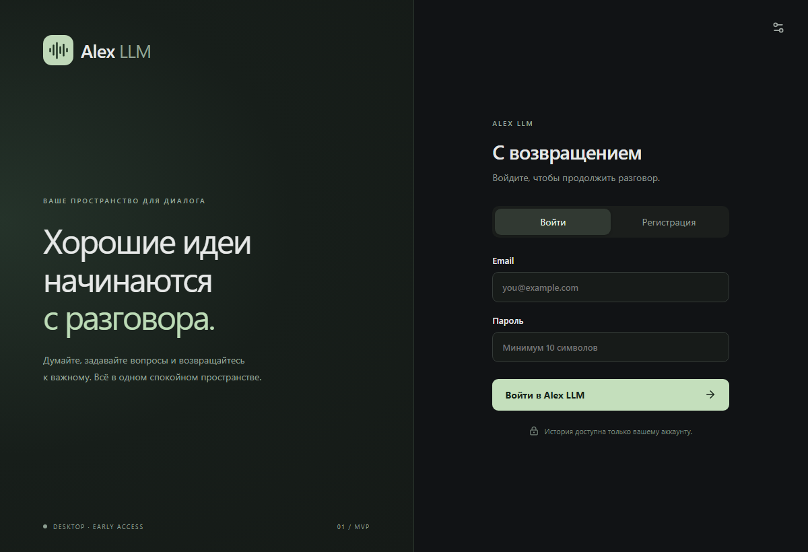
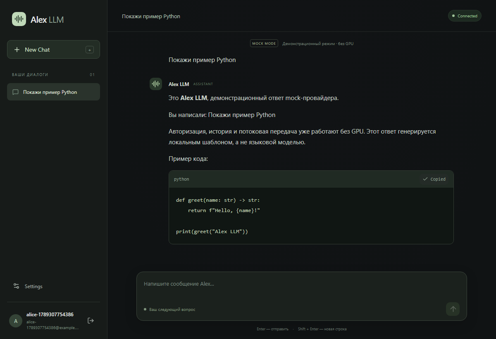
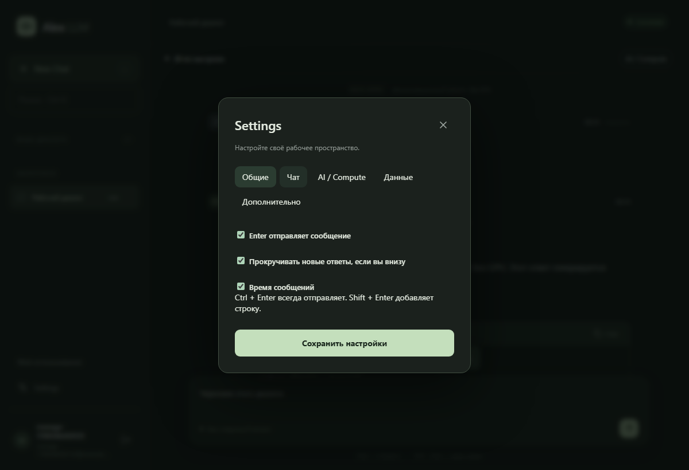
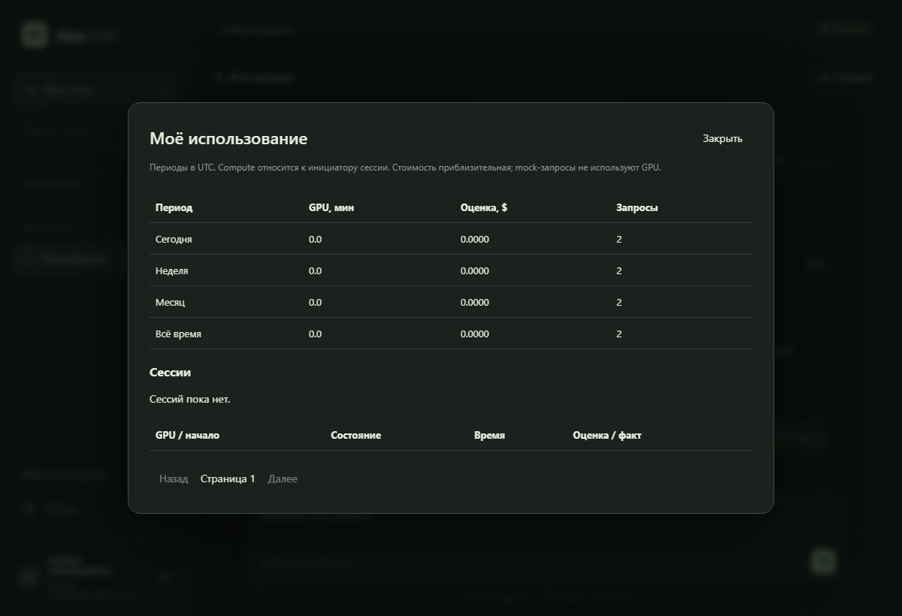
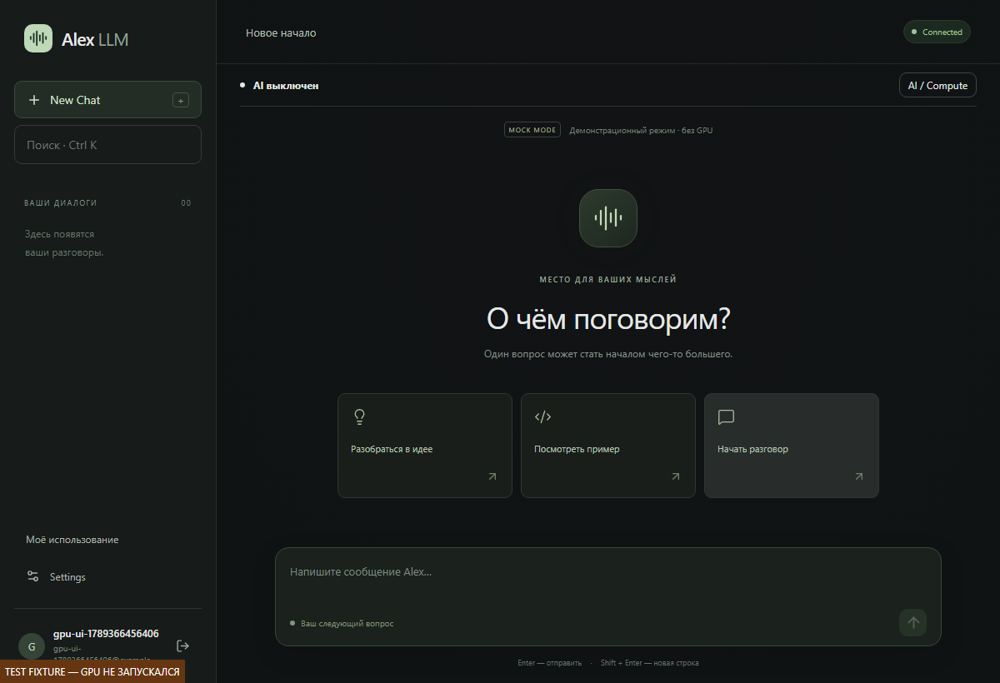
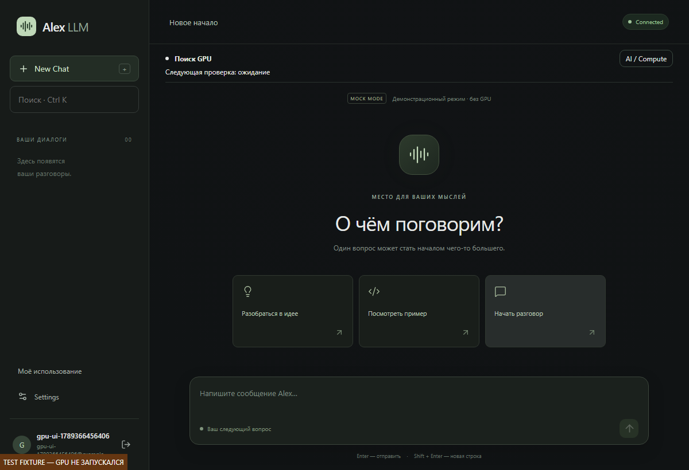
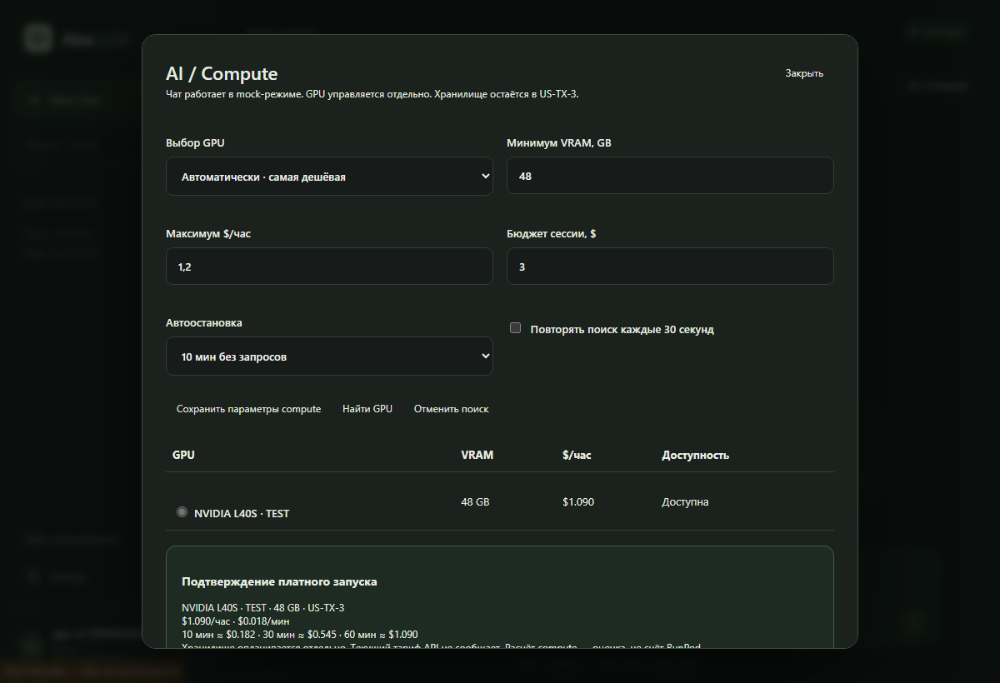
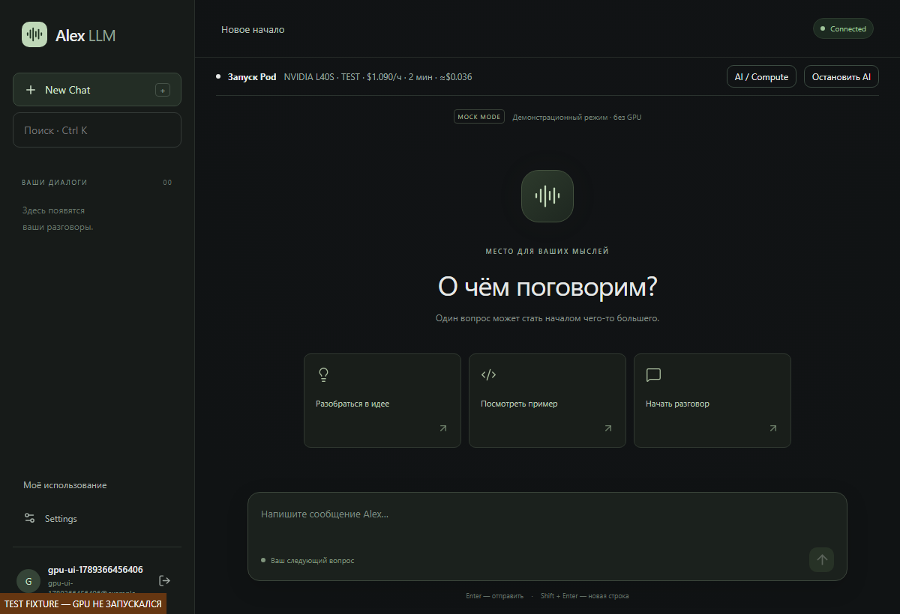
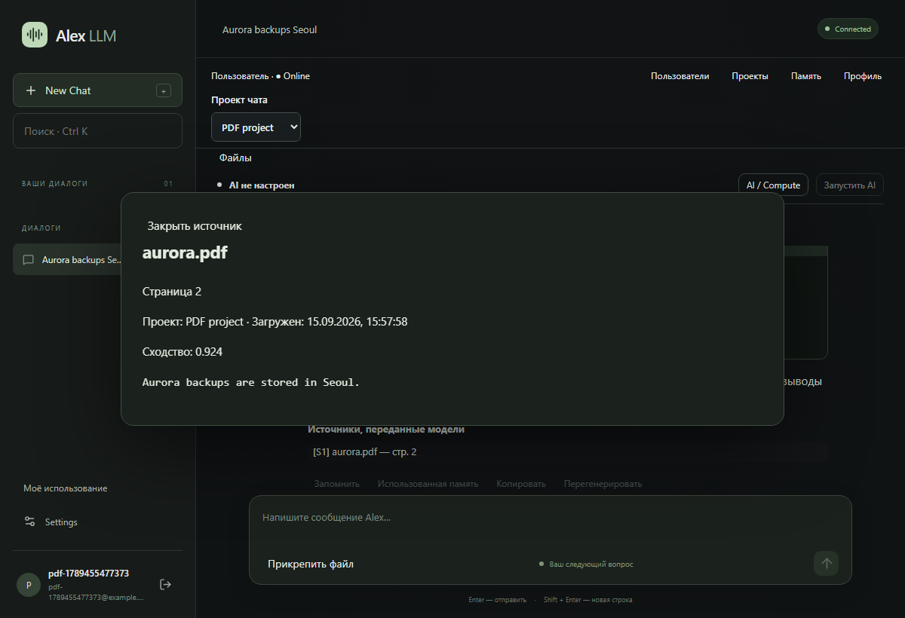
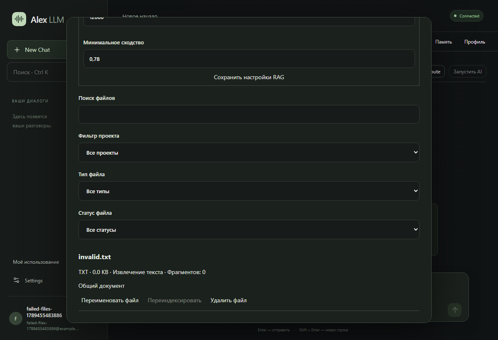

# Alex LLM — отчёты проверки

Текущий локальный этап: **0.8.3**. Automatic Tor research = **REAL PASS** (OrcaRouter, Mock=false). Direct tor_search/fetch remain REAL PASS from 0.8.1. Tor Browser GUI fallback is implemented as a fail-closed stub and was **not** REAL-tested.

## Проверка 0.8.3 — 17 сентября 2026

- Цель: model-driven automatic Tor research. Новых больших features нет.
- HEAD before: `842cd6e6bde6419c9b09c3532444f9557ebd0d8c` (0.8.2).
- Backend pytest: **245 passed, 1 skipped**. Ruff check/format — PASS.
- Native cargo test: **12 passed**.
- Frontend: **20 unit passed**, TypeScript, Prettier — PASS.
- Playwright: **15 passed**.
- RunPod: ONE L40S `o2ossjuc01e6jx`, US-TX-3, $1.09/h, billable **203s**, estimated **$0.061464**, `stop_reason=manual`. An earlier aborted create (`gm0h2x8a2pj9bj`, 52s, $0.015744) was stopped after a 409 while the model was still loading. **RUNNING GPU FINAL = 0**. Volume `uwgeaie5b0` preserved.
- TEST 1 sanity: `provider=llamacpp`, Mock=false, 18 chars, no Tor tools on math. **PASS**
- TEST 2 natural «Через Tor найди официальный onion-сервис Tor Project…»: OrcaRouter called `tor_search` (`origin=model`), 4 model `tor_fetch` + 1 `server_policy` fetch, T1–T8, real `.onion` fetched (`T1`), official clearnet over Tor classified `OFFICIAL_AND_REACHABLE`, onion hits `REACHABLE_UNVERIFIED`, answer 3046 chars without claiming unsupported official onion status. **REAL PASS**
- TEST 3 «Продолжи поиск по найденным onion-ссылкам…»: continued from previous T sources, new onion pages `/blog`, `/archived`, `/pending`, `/about`. **PASS**
- Server-policy fallback: GPU used model origin; silent-planner injection covered by local tests (`origin=server_policy`). **PASS**
- TinyFish Agent=0 Browser=0 Search=0 Fetch=0. SOCKS 127.0.0.1:9050. No local onion DNS. No Direct fallback.
- Tor Browser automation: **not tested**, do not claim PASS.
- Tauri release + NSIS x64 — PASS. ProductVersion **0.8.3**.
  - EXE `apps/desktop/src-tauri/target/release/alex-llm.exe` SHA256 `BD933FD1F3BF011E7D89206F3F005F77C46F4FC35ABE7127CBBA600F760D89CD`
  - Installer `apps/desktop/src-tauri/target/release/bundle/nsis/Alex LLM_0.8.3_x64-setup.exe` SHA256 `F4C067F6C13B0DA125805263ABB74B4475AAC6F7BFE089AD4E5ED6A137E663B4`

## Проверка 0.8.2 — 17 сентября 2026

- Цель: закрыть пять оставшихся REAL E2E пунктов 0.8 на ONE managed Pod. Новых больших features нет.
- HEAD before: `82c7c6034a327f2a1b458d2dc49acbb27a99e8ec` (0.8.1). `origin/main` совпадал; working tree был clean.
- Backend pytest: **232 passed, 1 skipped** (opt-in live TinyFish). Ruff check/format, Alembic upgrade head + check — PASS.
- Native cargo test: **12 passed** (lib + bin). `read_file` SHA256 prefix, patch conflict, git force/hard not armed.
- Frontend: **20 unit passed**, TypeScript, Prettier, Vite production — PASS.
- Playwright: **15 passed**.
- npm audit (production): **0**. pip-audit: **0** known vulnerabilities.
- Tauri release + NSIS x64 — PASS. ProductVersion **0.8.2**.
  - EXE `apps/desktop/src-tauri/target/release/alex-llm.exe` SHA256 `8D537F26D0C543E929845192CE65623398636B23B3ACFB42334C011451D4C6C8`
  - Installer `apps/desktop/src-tauri/target/release/bundle/nsis/Alex LLM_0.8.2_x64-setup.exe` SHA256 `3CC816B171AB83263BBF218DADE7A2E5E15E0AA1E002CD46F2B2780C04E55DC5`
- RunPod this run: catalog wait until US-TX-3 L40S LOW, then ONE Pod `plbskald4189bw`, NVIDIA L40S 48 GB, $1.09/h, billable **1967s**, estimated **$0.595564**, `stop_reason=session_budget`. **RUNNING GPU FINAL = 0**. Volume `orcarouter-storage` / `uwgeaie5b0` preserved. **ONE Pod; second pod not started.** Gateway and exact alias `orcarouter-qwen38-27b-q5km` became ready; sanity stream `provider=llamacpp`, Mock=false, usage complete.
- Coding Agent: disposable `%TEMP%\alex-llm-real-e2e\20260917T111342\coding-agent`, initial pytest FAIL (`divide(10,2)` → 20). Attempt **1/3**. Model called `list_directory`, `read_file`, `run_python`, `write_file`, `patch_file`, `git_status` with `origin=model`. SHA `27b4086d…` → `f8fe1a17…`. git diff `return a * b` → `return a / b`. Final pytest **2 passed**. Cursor did not fix the bug. **REAL PASS.**
- Model-driven Tor: planner burned `max_tokens=1200` on Qwen3 thinking, `tool_calls=[]`, answer length 0, T sources none. Direct tor_search/fetch remain REAL PASS from 0.8.1. SOCKS 127.0.0.1:9050 was Connected; no second Tor. Local fix: llama.cpp `chat_template_kwargs.enable_thinking=false`. **FAIL** on GPU; **FIXED LOCALLY / REAL RETEST REQUIRED.**
- RAG → OrcaRouter: embedding `model_ready=true`, disposable document indexed (`E2E_RAG_CODE_aa96f48bb1a9`, chunk_count=1), D1, answer `silver-lantern-otter`. **REAL PASS.**
- Stop generation: abort 3.001s after first delta, `status=stopped`, 301 partial characters persisted, `provider_stream_closed=true`, ReadTimeout=false. **REAL PASS.**
- Combined Web + Coding: one task, TinyFish Search=1 Fetch=1, `web_search` model + `web_fetch` server_policy completed, W1–W3, local pytest FAIL→PASS (`subtract` `+` → `-`), source changed, Alex fixed, Cursor did not. Final stream was cut by session budget (`answer_len=0`, usage status=error) after tools and pytest already passed. **REAL PASS** for the listed tool/source/pytest criteria.
- TinyFish Agent calls = **0**. TinyFish Browser calls = **0**.
- Local contract coverage for this patch: coding planner subset, Tor tools only on Tor intent, session owner sees `pod_id` (not volume id), llama.cpp thinking disabled.

## Проверка 0.8.1 — 16 сентября 2026

- Цель: закрыть 0.8.x реальной перепроверкой после `917c5c8` / `43463c6` / `1424c79` / `2757c7c`, без новых больших features.
- HEAD before: `2757c7c`. Working tree был clean; `origin/main` совпадал.
- Backend pytest: **229 passed, 1 deselected** (opt-in live TinyFish). Ruff check/format, Alembic upgrade head + check — PASS.
- Native cargo test: **12 passed** (lib + bin). `read_file` SHA256 prefix, patch conflict, git force/hard not armed.
- Frontend: **20 unit passed**, TypeScript, Prettier, Vite production — PASS.
- Playwright: **15 passed**.
- npm audit (production): **0**. pip-audit: **0** known vulnerabilities (local `alex-llm-backend` skipped, not on PyPI).
- Tauri release + NSIS x64 — PASS. ProductVersion **0.8.1**.
  - EXE `apps/desktop/src-tauri/target/release/alex-llm.exe` SHA256 `B9F90CBE9A1537256987F29C84E8C00FBD70EE0A7FD119EBB424AB89DF9D0E68`
  - Installer `apps/desktop/src-tauri/target/release/bundle/nsis/Alex LLM_0.8.1_x64-setup.exe` SHA256 `CA304BEE3518B4B9898AAAF83CB89AC1072D3CB830BFF8925FC1C2FE7BB730A0`
- RAG embedding `intfloat/multilingual-e5-small` revision `761b726dd34fb83930e26aab4e9ac3899aa1fa78`: **model_ready=true**, disposable document index **ready**, chunk_count=1. Это TEST PASS пайплайна, не model-driven OrcaRouter RAG.
- Confirmation immutable digest: paired native Windows host, correct device headers, wrong digest **409**, approval replay **409**, JWT-only host-result **401**. **REAL PASS**.
- Tor provider (explicit `/tools/execute`, не model-driven): Connected, SOCKS 127.0.0.1:9050, SOCKS5h ATYP 0x03, local onion DNS=false, Ahmia onion search completed, official Tor Project onion fetch completed. **REAL PASS** для direct provider; model-driven Tor **NOT TESTED** в этом прогоне.
- Native local smoke (get_system_info, mkdir, write/read/patch, run_python): **TEST PASS**.
- RunPod this patch: catalog US-TX-3 L40S availability NONE ~11 минут, затем LOW. Pod `qx9xehgintpwyf`, ~60 billable seconds, estimated **$0.018167**, stop_reason=manual (harness catalog-wait timeout during `starting_pod`). **RUNNING GPU FINAL = 0**. Volume `orcarouter-storage` / `uwgeaie5b0` preserved. **ONE Pod; second pod not started.**
- Coding Agent GPU retest: **NOT TESTED** (pod aborted before OrcaRouter talk). Previous 0.8.0 REAL E2E remains **FAIL** (Alex did not patch `calculator.py`).
- Stop generation GPU retest: **NOT TESTED**. Previous **PARTIAL**.
- RAG with OrcaRouter: **NOT TESTED**.
- Combined Web + Coding: **NOT TESTED**.
- TinyFish Agent calls = **0**. TinyFish Browser calls = **0**.
- Cursor did not fix the disposable calculator bug.

## Проверка 0.8.0 — 16 сентября 2026

- Backend pytest: **216 passed, 1 skipped** (opt-in live TinyFish). Coding tools registered; git_push SENSITIVE; force-push/`git reset --hard` CRITICAL; patch CONFLICT; rotate credential; LocalTask 0009; hard ceiling 32; CredentialBroker never reveals secrets.
- Native cargo test: **11 passed**. Disposable delete, patch conflict, HKCU test key, CRITICAL not armed, git force/hard blocked, git_status on temp repo, credential redaction, sanitized env.
- Frontend: **20 unit passed**, TypeScript, Prettier, Vite production — PASS. CRITICAL confirmation uses «Я понимаю риск — разрешить один раз»; Forget/Rotate buttons in Web & Tools.
- Playwright: **15 passed**, including Rotate/Forget visibility, no Agent auto-route, Web Off isolation.
- Ruff lint/format, Alembic 0009 check, cargo check, npm audit 0, pip-audit 0 — PASS.
- Tauri release + NSIS x64 — PASS. ProductVersion 0.8.0.
  - EXE SHA256 `EEDA2A43B5F80E95CE34A697A63039828D3404F42FB9DD9CEE70754573837A9D`
  - Installer SHA256 `4CA4AE80C3FFE49A8080311AD04A54DBBA42F9EBDE031E88B08BB51B43C1AD9D`
- Destructive live tests: only temp files and HKCU `Software\AlexLLM\Test`. No format/shutdown/BitLocker/boot/UAC/service stop.
- Paid TinyFish Agent/Browser = 0. RunPod paid actions = 0. LLM_PROVIDER=mock.

## Проверка 0.7.1 — 16 сентября 2026

- Backend pytest: **206 passed, 1 deselected** (opt-in live TinyFish). Path policy: full computer + UNC/`..`/secrets denied. Trusted auto-allows READ everywhere and in-root NORMAL_CHANGE; SENSITIVE/CRITICAL always confirm. Delete/registry/install/shutdown registered and gated. Pairing default `Windows device`, Forget revokes. Digest binds action+payload. Network Direct/Tor, no Tor fallback. LocalCredentialProvider never returns a raw secret.
- Native cargo test: **7 passed**. Disposable temp delete, HKCU `Software\AlexLLM\Test`, CRITICAL not executed by default, sanitized env omits app secrets, system paths allowed, secrets/UNC denied.
- Frontend: **20 unit passed**, TypeScript, Prettier — PASS. Confirmation shows explanation; CRITICAL has no Always allow; Network: Direct/Tor.
- Destructive system actions не выполнялись (нет format/shutdown/BitLocker/boot). Paid TinyFish = 0. RunPod = 0.

## Проверка 0.7.0 — 16 сентября 2026

- Backend pytest: **202 passed, 1 skipped** (opt-in live TinyFish). Включены WebRouter, `origin=server_policy`, Tor SOCKS5h ATYP=0x03 без local DNS, device pairing, JWT-only host-result 401, Trusted vs process confirmation, forbidden tools, sanitized env, native Job Object parent+child Stop.
- Frontend: **19 unit passed**, TypeScript, Prettier и Vite — PASS.
- Playwright: **15 passed**. Force-web только в Auto; Tor Search provider not configured; Computer default Ask; planner не вызывает Agent; Browser Advanced по-прежнему с per-action confirmation (fakes, 0 paid calls).
- Ruff lint/format, Alembic 0008 check (temp DB), cargo check, npm audit (0), pip-audit (0) — PASS.
- Tauri optimized release + NSIS x64 — PASS. ProductVersion 0.7.0. Рядом лежат `Alex LLM_0.7.0.exe` и `Alex LLM_0.7.0_x64-setup.exe`; прежний `outputs/Alex LLM.exe` был занят запущенным процессом и не перезаписывался.
- Локальные smoke: LLM_PROVIDER=mock; TinyFish key absent (Search/Fetch live не запускался); Tor SOCKS closed (tor_fetch live не запускался); disposable workspace read/write; outside-root denied; secret `.env` denied; `python-ok`; `powershell-ok`; Job Object native test PASS. Destructive system actions не выполнялись.
- Paid TinyFish calls = 0. RunPod paid actions = 0. `COMPUTE_BACKGROUND_ENABLED=false` в тестах; рабочий `.env` остаётся mock.

Ограничения: production Agent по-прежнему fail-closed. Real OrcaRouter/GPU E2E не выполнялся. Локальный Tor не был настроен, поэтому live onion fetch не запускался. Device credential в Credential Manager / DPAPI, не в Git и не в renderer.

## Проверка 0.6.0 — 16 сентября 2026

- Backend: **181 passed, 1 skipped** (opt-in live test); отдельный read-only live TinyFish Search + Fetch: **1 passed**. Финальные изменения Browser также проверены 16 provider contract tests.
- Tauri optimized release + NSIS x64 — PASS. EXE и installer обновлены в `outputs`, ProductVersion 0.6.0. About UI берёт версию из package.json. Ярлык сохраняет прежний путь.
- Frontend: **17 unit passed**, TypeScript, Prettier и Vite — PASS.
- Playwright: **15 passed**: embedding prepare/cancel/retry, обычный чат, Files с реальными CPU embeddings, Web+RAG D/W sources, owner isolation, fake Agent confirmation/Stop, Browser typed confirmation/denial/retry, missing key/Off.
- Ruff lint/format, pip check, npm audit, pip-audit pinned dependency closure, cargo check — PASS. Known vulnerability count: 0.
- Alembic: clean install, 0001 → head с сохранением history, foreign keys и check — PASS. Рабочая SQLite: backup API → 0006 → 0007, все прежние row counts сохранены, foreign_key_check пуст.
- Pinned E5 artifacts: 135392183 bytes, SHA256 LFS / Git blob SHA1, query + passage CPU smoke, dimension 384. Использован проверенный legacy import без нового скачивания.
- RunPod официальный MCP read-only: ry246k5siqujgu EXITED, RUNNING GPU 0. Active managed sessions в рабочей БД 0. Volume uwgeaie5b0: 50 GB STANDARD, US-TX-3, без изменений.
- Секреты не обнаружены в Git; моделей/БД/.env среди tracked files нет. TINYFISH_API_KEY получен только backend credential provider; живой smoke вывел только PASS.

Ограничения: production Agent заблокирован из-за отсутствия enforceable read-only/per-action approval в supplier API. Его fake/SSE/cancel contracts проходят, но это не реальная Agent E2E. Browser typed/CDP lifecycle покрыт fake/contract tests; платный supplier запуск не выполнялся. LlamaCpp tools покрыты HTTP contracts, реальный OrcaRouter tool calling ещё не проверен. PostgreSQL live, интерактивная установка/удаление NSIS и подпись приложения не проверялись. Warnings: Starlette/httpx deprecation, Vite chunk >500 kB, Windows WebSocket teardown 10054; все проверки завершились успешно.

## Сохранённый отчёт 0.2.0 — этап 2

Дата: 14 сентября 2026. Изменён существующий проект `volkrist/alex-llm`; стек Tauri 2 / React / FastAPI сохранён.
Отчёт предыдущей версии сохранён в [verification-v1.md](verification-v1.md).

1. **Чаты.** Переименование, удаление с подтверждением, поиск названий, закрепление/открепление. Закреплённые идут первыми, затем сортировка по обновлению.
2. **Экспорт.** Markdown/JSON одного или всех собственных диалогов. Backend проверяет владельца. В Windows используется системный Save dialog, в браузере — download.
3. **Сообщения.** Копирование, редактирование своего текста, изменение с повторной отправкой, перегенерация/Retry ответа. Повторная генерация линейно удаляет последующую историю.
4. **Streaming.** Постепенный SSE, «Alex думает…», Stop и сохранение частичного ответа. Пустой прерванный ответ остаётся доступным для Retry. Повторная отправка блокируется.
5. **Composer.** Автоматическая высота, Enter/Shift+Enter/Ctrl+Enter; черновики разделены по backend, пользователю и диалогу. Настройка Enter проверена в браузере.
6. **Навигация.** Ctrl+N, Ctrl+K, Ctrl+comma, Esc; контекстное меню чатов, время сообщений, кнопка прокрутки вниз. Новые ответы не уводят читателя от просматриваемого текста.
7. **Markdown.** GFM, таблицы, код, подсветка синтаксиса, Copy code. Raw HTML не исполняется. HTTP(S)-ссылки открываются системным браузером по нажатию.
8. **Настройки.** Общие, чат, AI/Compute, данные, дополнительные. Тема Dark/System, размер текста, русскоязычный UI, автопрокрутка/время/технические сведения. Backend URL вынесен в дополнительные параметры.
9. **RunPod-клиент.** `app/compute/runpod_api.py`: официальный REST v2, фиксированный API host, тайм-ауты, структурная валидация и безопасные ошибки. Runtime не использует MCP.
10. **Выбор GPU.** NVIDIA Secure, существующий Volume в US-TX-3, configurable VRAM/цена/бюджет. Автоматически — самый дешёвый доступный вариант; вручную — выбранная GPU. Недоступные/дорогие варианты отключены.
11. **Подтверждение цены.** Стоимость часа/минуты/10/30/60 минут, отдельное замечание о storage, срок предложения. Перед create — повторная проверка. Fallback ограничен тремя кандидатами не дороже подтверждённого.
12. **Контроллер.** `app/compute/controller.py`: DB lease, committed create intent, idempotency, deterministic Pod name, recovery. Неопределённый create не повторяется автоматически. Существующий Pod не дублируется.
13. **Готовность.** Реальные состояния поставщика и свежие фазовые маркеры existing startup/check scripts. Нет фиктивных процентов/TPS. Устаревшие logs не означают Ready.
14. **Время и стоимость.** Supplier started_at отдельно от ready_at; backend считает elapsed/estimated cost. Историческая ставка сохраняется. Actual cost запрашивается отдельно; отсутствие данных остаётся null.
15. **Бюджет/автостоп.** Достигнутый бюджет запрещает новую генерацию; остановка ждёт текущую. Idle timeout применяется после Ready без активной генерации. Network Volume не удаляется. Внешний Pod не останавливается автоматически.
16. **Пользователи/админ.** ADMIN_EMAILS только на backend; ALLOW_USER_COMPUTE_START=false по умолчанию. Личное использование за день/неделю/месяц/всё время, история сессий; админ видит пользователей, общие сессии/расходы и управление compute.
17. **Миграция.** Alembic 0002 добавляет роли, поля чатов/сообщений, compute_control/sessions/events/quotes/preferences и generation_usage. Проверено сохранение данных 0001 → 0002, чистая БД в E2E и `alembic check`. Рабочая SQLite обновлена после backup API.
18. **Безопасность.** RunPod key отсутствует в frontend/exe; хранится только в backend env. Без ключа Not configured, mock работает. Ownership новых chat/export/edit endpoints и admin permissions покрыты тестами. CORS и JWT не ослаблены.
19. **Проверки.** 39 backend pytest, 8 frontend unit tests; Ruff, Prettier, TypeScript/Vite, cargo check, Tauri release и NSIS build. Браузерные сценарии: базовый чат/изоляция, mobile/offline, новые функции чатов, test-only compute UI. Нативный WebView2 smoke проверяет регистрацию, streaming, Copy, Stop, историю, удаление и выход. npm audit: 0 vulnerabilities.
20. **Артефакты.** `../Alex LLM.exe` и `../Alex LLM Setup.exe` относительно корня проекта. Ярлык `C:\Users\Volkr\Desktop\Alex LLM.lnk` указывает на обновлённый exe. Пользователю desktop не нужны Node/Rust/Python; нужен доступный backend и WebView2. Backend остаётся отдельным сервисом.
21. **Границы проверки.** Реальный платный запуск RunPod не выполнялся. Живые startup scripts/model/image и фактический billing не проверены; использованы HTTP mocks. Installer собран, интерактивная установка/удаление не проверялась. PostgreSQL не запускался. Native save dialog/open-browser не включены в автоматический smoke; browser export проверен. Приложение не подписано. Нет подключения реального LLM к чату, Memory/RAG/агентов/LoRA.

## Существенные ограничения

RunPod API не предоставляет атомарную гарантию max-price для create. При изменении цены между проверкой и созданием возможна короткая платная сессия до защитной остановки.
Бюджет — ограничитель по polling, не предоплаченный потолок: текущая генерация и задержки API могут дать превышение.
Мониторинг/автостоп работает, пока работает backend. Chat recovery требует одного backend worker.
Оценка стоимости — не счёт RunPod; хранение оплачивается отдельно, текущий тариф API не сообщает.

Чат остаётся `LLM_PROVIDER=mock` по заданию. Test-only UI fixtures находятся только в Playwright; production-переключателя вымышленных состояний нет.
Официальный контракт и команды настройки: [runpod-controller.md](runpod-controller.md). API/структура: [architecture.md](architecture.md).

## Снимки экранов

Ниже GPU-состояния с суффиксом `test` получены через Playwright interception, а не через запуск платного Pod.

SHA256 executable: `C23977A9E2B13991912DD21C6335A1F55952AE76346F62D4658BDA4CFEA8E1AA`.
SHA256 installer: `D6958D5AD93F421AB3661A47F54F5A48529B1D1C68DB8C21BE4C15AE3E428105`.

## 0.4.0

Current local Presence/Memory/ContextBuilder checks are recorded in [verification-0.4.md](verification-0.4.md). Earlier GPU preflight observations in this document are historical and do not establish a successful real-model E2E.

## 0.5.0 — Files / RAG, 15 сентября 2026

- Предварительный compute commit: `1a6cb8654b68b93240d886cc61ef175bf7613208`, отдельно запушен в main; после него clean. Cleanup commit: `73e020b`.
- Used Memory отображает сохранённые backend metadata конкретного generation: project, выбранная память/категории/символы, история, полный размер и текущий запрос ровно один раз. Старые записи без metadata показывают неизвестные значения.
- Compute UI загружает canonical preferences; не допускает поиска до их загрузки, показывает сохранённые и активные лимиты отдельно. Значение 0.82 может существовать как сохранённое предпочтение пользователя, но не является скрытым hard ceiling.
- TTFT UX: sending → ожидание первого ответа → обработка запроса после 8 секунд → streaming → completed/stopped/error. Реальный elapsed, без процентов. Timestamps/TTFT nullable; upstream_cancel_confirmed остаётся null без отдельного доказательства. Отмена до первого токена покрыта тестом.
- PDF/DOCX/TXT/MD → безопасное local storage → extraction → token-aware chunks → реальные локальные CPU embeddings → ownership/project filtered cosine retrieval → ContextBuilder → MockLLM → persisted source panel. [Архитектура RAG](rag.md), [Файлы и ограничения](files.md).
- Backend: 120 pytest PASS, включая три реальных CPU-теста RU/EN/KO; файловые проверки включают ограничение parser memory. Ruff check/format PASS. Frontend: 13 unit PASS; TypeScript, Vite, Prettier PASS. Playwright: 10 PASS, существующие функции и три файловых сценария.
- npm audit: 0 vulnerabilities. pip-audit: no known vulnerabilities (локальный пакет alex-llm-backend отсутствует на PyPI и проверяется исходниками/тестами). Обновлён локальный инструмент pip, исходно устаревший; зависимости приложения без известных findings.
- Alembic: clean install, 0005→0006, upgrade реальной локальной БД после SQLite backup PASS. Все 14 прежних таблиц сохранили количество строк; foreign_key_check PASS; alembic check без новых операций.
- CPU benchmark: quantized E5, 384 dimensions; cache 135,392,183 bytes; cold first batch 3.0151 s; warm query embedding 0.0059 s; TXT 2,900 bytes indexing 0.3121 s, Ready. RU/EN/KO queries selected the correct document among three examples. Порог по умолчанию откалиброван до 0.72: русский запрос к английскому источнику даёт 0.753, нерелевантные примеры 0.671/0.652. Это небольшая локальная выборка, не общий benchmark качества или worst-case latency.
- Read-only RunPod: только `ry246k5siqujgu` / `orcarouter-l40s` / EXITED; RUNNING GPU 0. Active managed sessions 0, search offline. Network Volume `uwgeaie5b0`, STANDARD 50 GB, US-TX-3 сохранён. Paid mutations 0.
- Ограничения: single backend worker; exact local vector scan; OCR и selected-file-only mode не реализованы; panel показывает переданные источники, не гарантирует цитирование моделью. Нет inline citation rewriting, cloud storage или pgvector. Real OrcaRouter RAG остаётся для отдельно разрешённого этапа.
- Известные предупреждения: Vite bundle >500 kB; два deprecation warnings TestClient/AnyIO; Windows asyncio иногда пишет connection reset при закрытии тестового WebSocket. Проверки завершаются успешно. Интерактивная установка NSIS не выполнялась; приложение не подписано.

- cargo check PASS; Tauri 0.5.0 release PASS; NSIS x64 installer PASS. EXE и Setup обновлены в outputs, существующий Desktop shortcut указывает на EXE 0.5.0. Рабочий backend /health сообщает mock, API version 0.5.0, compute monitor отключён.
- EXE SHA256: `306A6B8BA0C9AFA22911946947532B2D0C6D9E5E87BEF8B59530E49FD8E92F11`.
- Installer SHA256: `9109D06655FA65D5F01611AC488C5552FC151E8A7F5FD98AD0AB89D55212D02C`.
